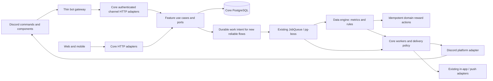

# DevLoot Discord: contribution, community, and the first omnichannel rollout

Planning proposal · 2026-09-23 · primary outcome: meaningful developer contributions and repeat participation.

Updated after reviewing committed Core `066d18f` and fetched `feat/data-engine` at `4f890b3`. See the [engine integration review](discord-data-engine-review.md) for the implemented/planned split, reliability prerequisites, and revised implementation sequence.

Execution details are in the [implementation plan](discord-implementation-plan.md), with work packages and acceptance checks for test guild `1494925337811751002`.

## Recommendation

Make Discord the place where developers discover work, find collaborators, and celebrate progress, with DevLoot Core owning the underlying identity and work. The first release should connect **profile → fitting issue → contribution → recognition → next visit**. Dream Team and JEV moderation follow through the same Core capabilities.

Keep this bot repository as a thin, separately deployed Discord gateway for now. Move shared business decisions into Core incrementally, using its existing feature modules, ports, PostgreSQL, and pg-boss workers. Adopt the data engine as the shared metrics and configurable reward-rule layer once its reliability prerequisites are met. Keep domain authorization, notification delivery, and moderation decisions in their respective owners. Repository consolidation is optional later; a new event broker or generic channel framework is unnecessary for this pilot.

“10 times more engaging” is a product ambition, not an impact forecast. Measure contribution and return behavior before choosing a numerical growth target.

## What the code actually supports

Inspection covered the bot at `588dc0d`, committed Core `066d18f`, and `origin/feat/data-engine` at `4f890b3`. Profile judgments and real-profile matching are now committed. The engine branch and current Core branch diverge and require integration; their capabilities are not all present in a single checkout. “Exists” below means present in source, not verified deployed or production-ready. No live Discord activity, production configuration, database contents, or usage analytics were inspected.

| Capability | Evidence and current behavior | Reuse assessment |
|---|---|---|
| Bot onboarding, progression, proposals | Slash commands, verification, XP tiers, daily streaks, proposal voting, Scout and weekly Chef roles, automatic threads | Keep the interaction concepts; consolidate state and policies in Core |
| Quests | One hardcoded quest, awarded for posting in a particular channel; dispatcher also calls completion after `/propose` | UI shell exists; meaningful contribution validation is new |
| Bot feeds | Rich bounty/project notification methods exist but no call sites were found in this standalone bot | Reuse presentation ideas; do not assume this is the active event pipeline |
| Core Discord integration | `platform/discord/DiscordClient`, `NotifierPort`, bounty notification jobs, XP event subscriber and role-sync worker | Strong foundation; currently plain bounty-feed messages and single-guild configuration |
| Profiles | Wallet-based profile counts; committed persisted AI profile judgments by GitHub username, ranking and contributor matching | Read-only profile cards are a strong early feature; identity aggregation and deployment validation remain |
| Achievements | Public project/wallet achievement reads and authenticated claim flows | Show existing earned achievements first; new achievement types have their own eligibility work |
| Feed | `GetRecentFeedUseCase` combines newly created bounties and projects | No general activity stream, preferences, or personalized issue ranking yet |
| Dream Team | Issue drafting/judging, subtasks and team recommendations now use stored developer profiles via `PROFILE_RANKING` | Real candidate matching exists. Assignment use case supports real usernames, but the HTTP assignment endpoint remains disabled; draft workspace persistence is browser IndexedDB |
| Real contributor matching | `MatchContributorsForIssueUseCase` evaluates stored generated profiles against an issue | Useful starting point, but not opt-in availability, team membership, invitations, or issue recommendations for one developer |
| Native notifications | Preferences and delivery outbox for bounty-created mobile push | Reuse patterns; existing outbox is tied to push devices, not a universal notification outbox |
| JEV | `TypeSafeClient.systemOne`, typed choice/score judgments, existing domain-specific judgment ports | Transport and judgment pattern reusable; moderation taxonomy and accuracy are unproven |
| Community moderation | Report, hide, restore, dismiss, permission checks, transaction and audit trail for project comments | Reuse policy/audit concepts; Discord messages have different actions and permissions |
| Data engine, separate branch | Trackable ledger/snapshots, reactive/scheduled rules, XP/achievement executors, admin UI; issue votes are its only wired production producer | Reuse this for configurable engagement rules; event bridge/backfill are documented but not implemented at the reviewed commit |
| Issue engagement, engine branch | Issue votes, comment ownership/upvotes and GitHub timeline APIs/UI | Useful for shared web/Discord issue cards; timeline reads are not a durable activity feed |

Source pointers are collected at the end of this document.

## The experience to build

A developer joins, connects GitHub and Discord, and sees a compact DevLoot builder card. They select their interests and choose “Find something to build.” The bot shows three curated or filtered issues with a clear reason to try each. They open a discussion thread, optionally join a squad, and continue on GitHub. Verified progress updates their DevLoot profile and produces a useful Discord celebration. Their next visit starts with their work and one relevant next step.

Use public channels for discovery and celebrations; private interaction responses for personal suggestions and preferences. Let a member explicitly share a profile or achievement card. Keep wallet signing, funding, payouts, and complex project editing in the existing web flows with contextual links.

### Prioritized experiences

Effort below describes incremental work after the shared identity and API foundation. S ≈ 2–4 engineering days, M ≈ 5–10, L ≈ 10–20+, including focused validation. These are planning ranges, not delivery commitments; capabilities share dependencies and should not be summed mechanically.

| Order | Experience | Reuse and new work | Effort |
|---|---|---|---|
| 1 | **Builder passport** — `/profile`, `/profile @member`, `/achievements`; stack, specialties, contributions, tier, earned badges; Share button | Core profile and achievement reads; add authorized Discord-to-Core identity resolution and a public-safe combined projection. AI information is optional and labeled | S–M |
| 2 | **Opportunity board** — `/bounties` with language/project filters and one clear next action | Core bounty/project/issue reads; add compact cards and filters. Start curated/rule-based, then add `/match me` with measured relevance | S for browse, M for personalized ranking |
| 3 | **Useful feeds** — new work, shipping wins, project spotlight, weekly recap | Existing bounty events and feed reads; new delivery preferences, topic routing, and explicit events for anything not already represented | M |
| 4 | **My next contribution** — improve `/daily` and `/quests` to show progress and one useful task | Reuse daily/streak presentation plus engine trackables/rules. Add verified completion producers, reward idempotency and progress reads | M |
| 5 | **Party up** — `/squad find`, interest buttons, a small issue-centered working group | Reuse real profile matching and thread UI. Availability, invitations, acceptance, membership, and progress are new state | M–L |
| 6 | **Dream Team brief** — `/dreamteam plan <issue>` returns proposed subtasks and required specialties | Reuse issue/subtask judgment and drafting; keep premium and maintainer permissions. Preview first, reviewed GitHub writes later | M for preview; L for full lifecycle |
| 7 | **JEV moderation assistant** — classify reports, propose actions, help maintain a welcoming developer space | Reuse TypeSafe transport and community audit patterns; add Discord moderation module, review UI and evaluation | M for shadow/review mode |
| 8 | **Community seasons** — shared shipping goals and recognition for helpers and first-time contributors | Reuse contribution/achievement data; new campaign and attribution rules | M after reliable evidence exists |

The fun should come from visible identity, belonging, useful progress, and recognition. A first merged contribution, a squad shipping together, or a maintainer thanking a helper deserves more attention than repeated check-ins.

### Start with three feeds

1. **Opportunities:** selected new bounties and approachable issues. Show stack, task, reward when funded, and “View issue / Discuss / Follow.” Avoid presenting unfunded issues as paid work.
2. **Shipped:** confirmed bounty wins and earned achievements first. Ordinary merged PRs need additional GitHub ingestion and attribution; they are not supplied by the current generic feed.
3. **Weekly DevLoot:** contributions, first-time contributors, open squad slots, and a project spotlight. Skip empty recaps and link to evidence.

Later: followed-project milestones, requests for review, and personally relevant opportunities. Each feed item needs a canonical entity link and one primary action. Default to no mass mentions; personal notifications require opt-in. Start with a small public digest cap, then tune to actual community volume. Avoid opening many empty channels.

### Dream Team should develop in two steps

**First: a planning companion.** A maintainer brings an issue; DevLoot drafts a work breakdown and explains the specialties needed. Discord supports review and discussion, with a web handoff for the larger editing flow.

**Then: real squads.** Build on the committed real-profile candidate pool, adding opt-in availability and interests. Suggestions are invitations, not assignments. Members accept or decline; a maintainer approves any GitHub assignment or issue creation. Add a canonical squad/mission record in Core and map its Discord thread to it. Browser IndexedDB persistence does not yet allow the same draft to resume in Discord or on another device. Some controller descriptions and the legacy pool endpoint still refer to simulated candidates; the actual team-suggestion implementation now reads real profiles.

Do not publicly rank people by inferred AI skill as the main game mechanic. Use matching to help someone contribute; use observable contributions for recognition. Core’s existing profile matcher finds people for an issue; finding issues for a person is a separate capability.

## Omnichannel architecture

Omnichannel means a member can begin a workflow in Discord, continue on the website, and receive relevant updates through their chosen channel while retaining the same identity, state, and permissions.

### Ownership

| Owner | Responsibilities |
|---|---|
| Bot repository | Gateway connection, incoming Discord events, slash commands, buttons/modals, immediate acknowledgments and interaction rendering |
| `users` | Canonical member identity, linked Discord account, XP ledger and tier policy |
| `bounties`, `projects`, `achievements` | Their existing business rules, eligibility and state |
| `engine`, from the data-engine branch | Trackables, metric projections and configured milestone/ranking rules; dispatches registered actions through domain ports |
| Thin `engagement` feature, only for concrete workflows | Daily/quest completion evidence, proposal policy, consent and season lifecycle; feeds the engine rather than implementing another rule evaluator. Issue voting stays in `issues` |
| `devloot-dreamteam` | Planning and future squad workflow; existing access/maintainer rules remain effective |
| `notifications` | Subscriptions, recipient selection, digest policy, durable delivery state |
| New `moderation` feature | Assessments, cases, moderator decisions and action policy; Discord enforcement through a port |
| `platform/discord` | Discord HTTP transport for messages, threads, roles and moderation actions; no XP or contribution rules |
| `platform/typesafe` | JEV transport; domain-specific classification policies belong in their feature |

The bot calls versioned, authenticated Core endpoints. Core controllers invoke their feature use cases; cross-feature collaboration uses exported ports/events, consistent with the current dependency rules. Do not import another feature’s application internals or make the bot read Core tables directly.

Keep outbound feed delivery and tier-role ownership in Core workers. The gateway responds to interactions. If both processes use the same Discord bot token, coordinate REST rate-limit behavior across those processes; separate in-memory limiters do not know about each other. A single outbound worker is a reasonable pilot starting point.

The Core API remains stateless. Retain the separate gateway process because member/message/reaction events need a persistent connection. Run one active gateway instance for the pilot; define connection ownership before scaling replicas. Recurring Chef checks and digests belong in pg-boss, replacing the bot’s `setInterval`.

### Identity and authorization come first

The bot currently sends `/connect?discord_id=...`. The inspected Core Connect page does not establish that link, and its GitHub OAuth controller deliberately ignores caller-supplied Discord identity. Existing links may still work; a fresh member’s linking journey needs an end-to-end repair.

Proposed `/connect` flow:

1. The trusted bot adapter begins a short-lived, one-use link request bound to the actual Discord interaction user and guild.
2. The developer signs into DevLoot through the existing GitHub/community identity flow and sees which accounts will be linked.
3. Require Discord OAuth identity proof or a confirmation from that same Discord account before completing the link. A forwarded link alone must not let a different person take over the association.
4. Core atomically consumes the link request, enforces uniqueness, and records the association to canonical `User.id`. Support unlink/relink and conflict handling.
5. Core awards any first-link reward once and schedules roles; the bot renders the resulting profile.

Use authenticated service-to-service requests with short-lived, audience-scoped credentials and request IDs. Trust Discord identity only through that authenticated adapter; Core resolves the linked principal and checks feature permissions. A bot credential must not become blanket permission to impersonate arbitrary Core users. Recheck actor, guild and current state when a button is pressed.

Use GitHub identity for community participation without requiring a funded wallet. Wallet-dependent profile/achievement sections are optional. Current profile-generation authentication is wallet-based, so a GitHub-only generation path is new work. Keep browser cookies and OAuth tokens out of the bot, and preserve Dream Team entitlements and repository maintainer checks in channel-independent policy before allowing Discord writes.

### Reliable events and delivery

Core’s `DomainEventBus` is **in-process and non-durable**; it cannot connect the separate bot process to Core. pg-boss is the existing cross-process durable job mechanism, but a queue dedupe key is not a permanent business idempotency record.

For new reward and delivery flows, persist the domain change and durable work intent in the same database transaction. A worker publishes jobs through `JobQueue`, and consumers track processed business keys. This needs a small transactional outbox/work-intent capability; it is not already guaranteed by `publish()` after a database update. Add it where the first reliable slice requires it, then migrate existing side effects incrementally.

The engine's `EngineTrackEvent` is a metric ledger, not that transactional outbox; `EngineRuleExecution` currently records only last-fired state, not per-action retries. Extend those existing owners with event deduplication, atomic execution reservation and durable action outcomes rather than building competing mechanisms in the bot. The planned event bridge's mapping catalog is reusable, but its in-process listener design alone does not close the durability gap. See the [engine review](discord-data-engine-review.md).

Suggested contracts, all new unless already identified above:

- `CommandContext`: source channel, authenticated actor reference, guild, interaction/request ID, correlation ID. Authorization comes from verified context, never user-editable text.
- `XpAward`: unique `(userId, reason, sourceId)` plus amount, timestamp and policy version; ledger insertion and total increment are atomic.
- `DeliveryIntent`: event ID, category, recipient or configured audience, entity reference, channel and preference/version context. Unique delivery key per event/destination.
- `ChannelMessage`: entity/event key, guild, channel, message and thread IDs. Persist acknowledgments so later updates edit the same card.
- `Subscription`: user or guild destination, topic/project, cadence, enabled state. Keep private preferences separate from public guild routing.

Extend notifications around existing ports. Preserve native push while introducing Discord delivery records; the current `NotificationOutbox` has a required push-device relation and cannot simply be reused as-is. Do not claim atomic delivery between Discord and PostgreSQL: a send may succeed before its message ID is recorded. Define retry/reconciliation behavior for this uncertain outcome and avoid promising exactly-once external sends.

## JEV-assisted moderation

JEV is a plausible **assessment engine** here because Core already asks typed questions about issues, projects, and developers. Whether it is accurate enough for moderation must be measured separately.

Use Discord’s native rules for straightforward spam/mention blocking, and JEV for context-dependent triage: scam solicitation, targeted harassment, repeated disruptive promotion, or a discussion that needs moderator attention. Ordinary disagreement, beginner questions, code snippets, quoted abuse in reports, and bilingual discussion must not be treated as violations by default. Discord exposes native AutoMod rules and actions in its [Auto Moderation API](https://docs.discord.com/developers/resources/auto-moderation).

Proposed path:

`reported/selected message → Core moderation intake → queued JEV assessment → policy decision → private moderator case → explicit action → Discord adapter + audit result`.

Start with a message context-menu “Report” action and opted-in pilot channels. Add message create/update ingestion only where needed. Reports preserve the target message ID, bounded context, policy version and content version/hash; repeated reports coalesce into one case. A changed or deleted message invalidates a stale action proposal.

JEV should return constrained categories, severity and uncertainty, with an abstain path. Core policy maps these to review recommendations; the model never chooses arbitrary API operations, URLs or permissions. Treat message text as untrusted data. Do not fetch arbitrary links or execute commands contained in messages. Associate evidence with actual captured messages; generated explanations are not independent evidence. Validate the response at runtime: missing answers, invalid scores, timeouts or unavailable context produce no sanction. Record model/rubric versions because the current model alias can change.

Roll out in stages:

1. **Shadow:** assess a permissioned, minimized sample; compare against moderator labels. No member-facing enforcement.
2. **Assist:** private review cards with message link, rule, context and Dismiss / Warn / Timeout / Delete choices as appropriate. Reauthorize the moderator at execution time, check Discord permissions and role hierarchy, and record both decision and execution outcome.
3. **Narrow automation:** only after measured performance, enable specific approved actions for well-defined cases. Keep bans and ambiguous conduct decisions with moderators initially. Native deterministic rules remain available if JEV fails.

Build a reviewed evaluation set containing technical arguments, Portuguese/English/code-switching, scams, quoted text, security discussions, repeated messages, and prompt-injection attempts. Measure per-category precision/recall, false positives, moderator overturn rate, abstention, review time, cost and latency. Audit unflagged samples to estimate missed violations. Model confidence is not a calibrated safety threshold. Require moderator sign-off on measured thresholds and enough relevant examples before promoting an action to automation.

Minimize message data sent to JEV, disclose the moderation processing, exclude DMs/private channels by default, and configure short evidence retention with restricted access. Verify provider data handling before the pilot; omit raw content from operational logs. Do not reuse moderation flags for developer matching or public XP rankings, or automatically extend guild sanctions to other channels. Provide a reason and appeal path. Timeouts can be reversed; deleting a Discord message is not equivalent to Core’s reversible comment hiding, so start with review before deletion. Asynchronous JEV assessment happens after receipt; it does not provide pre-publication blocking.

Full message-content moderation requires the relevant privileged intent; it is not needed for the slash-command features. The architecture skill’s blanket description of Message Content as “deprecated” is too broad: Discord’s current documentation still describes it as a privileged intent. Verify enablement and approval requirements for the deployment. [Discord Gateway documentation](https://docs.discord.com/developers/events/gateway#privileged-intents).

## Migration issues to fix before rewarding more behavior

These are source-level findings, not a complete security audit.

- **Two XP/role owners:** bot services and Core users both implement progression and role changes. Select Core as the sole writer per migrated capability and preserve current tier behavior initially.
- **Repeated XP backfills:** `/sync-points` adds historical bounty totals on every invocation. Replace it with a ledger-backed reconciliation command. Core’s `AwardXpUseCase` also increments without a durable award key, so centralization alone does not solve this.
- **Quest validation:** completion follows `/propose` even when its handler returned an error response, and posting in a hardcoded channel can complete a quest. Complete only from a successful persisted domain outcome.
- **Concurrent rewards:** daily claim/streak/XP updates are separate writes. Make them one transaction with a unique claim key. Preserve current rules during migration; separately approve any calendar-day/streak redesign.
- **Proposal votes:** add-event toggling, count arithmetic, and XP on vote changes need an explicit idempotent vote model. Prefer buttons backed by one voter/proposal record; preserve old-message handling during cutover.
- **Schema ownership:** the bot ships an older Core-shaped Prisma schema and runs migrations in its Docker startup. Verify whether both deployments target the same database before touching data. Core must become the only owner of Core migrations; remove bot business-table access after cutover.
- **Legacy identity stubs:** the bot can create placeholder GitHub identities. Inventory and reconcile them without merging users by display name; use proven identity links.
- **Incomplete feed wiring:** determine which deployment currently posts each feed. Disable one producer when the new route is enabled so people do not receive duplicate updates.
- **Long interactions:** defer before database/API/AI work; use persistent request status for long jobs. Discord requires an initial acknowledgment within 3 seconds and limits interaction-token follow-ups to 15 minutes. [Discord interaction reference](https://github.com/discord/discord-api-docs/blob/main/developers/interactions/receiving-and-responding.mdx).
- **Operational details:** move command registration to an explicit deployment step, replace hardcoded channel IDs with validated configuration, remove token-prefix logging in verification, bound AI cost, and honor Discord rate-limit headers/`retry_after`. [Discord rate-limit reference](https://github.com/discord/discord-api-docs/blob/main/developers/topics/rate-limits.mdx).

## Delivery plan

Assumption: one pilot guild, existing hosting/PostgreSQL retained, one engineer focused on Core and one on Discord/product with part-time moderator input. Re-estimate after Phase 0. Calendar ranges overlap only where prerequisites permit.

| Phase | Deliverable | Dependencies and exit gate | Rough calendar |
|---|---|---|---|
| 0 — Baseline and decisions | Verify deployed versions, DB ownership, feed producer, linking journey and current guild activity; integrate the engine and profile branches. Define analytics and pilot channels | Written compatibility inventory and baseline; agree event, actor and action contracts with the engine owner | Re-estimate branch integration; baseline 2–4 days |
| Engine foundation — prerequisite for shared rewards | Durable ingestion, event IDs, atomic rule reservations, per-action outcomes, canonical identity and correct schedules; complete event bridge/catalog | Replay and concurrency cannot duplicate XP; failed actions retry; schedules and time windows behave as configured | Re-estimate with engine owner; profile/discovery work can proceed independently |
| 1 — Identity + passport | Core channel authentication/linking; `/profile` and existing achievements; contextual web links; first central XP slice | A new GitHub-only member can link safely, view a card and resume on web; duplicate link/claim awards prevented | 1–2 weeks |
| 2 — Discovery + recognition | Browse/filter bounties, opportunity cards, shipped feed, opt-in preferences, weekly digest; delivery tracking | One source event leads to intended destinations; retry, stale-card and unsubscribe behavior verified | 1–2 weeks |
| 3 — Contribution loop | Verified daily/quest/proposal producers and engine rule templates; shared issue voting and idempotent XP; retire duplicate bot writes | Confirmed actions award once across channels; legacy totals preserved; fake/replayed activity does not earn again | 1–2 weeks after engine foundation |
| 4 — Squads and Dream Team | Add opt-in/availability to existing real candidate pool; server-persisted plans, invitation/acceptance and shared thread | Authorization parity, accepted participation and resumable web/Discord progress | 2–3 weeks, re-estimate after persistence design |
| Moderation track | JEV shadow evaluation, then moderator review cards | Labeled evaluation and moderator review before enforcement; Core failure leaves deterministic protections working | 1–2 weeks for tooling; observation time additional |

The first public milestone is **safe linking + builder passport + browseable work + useful celebrations**. Aim to validate that smaller loop before investing in the complete Dream Team lifecycle. Run moderation shadow evaluation alongside it if moderator capacity is available.

### First implementation slices

Each slice should be reviewable and independently enabled for the pilot guild:

1. Add characterization tests for the current successful onboarding, daily claim, valid proposal and tier behavior; record known bugs separately. Add command acknowledgment/error handling and an explicit command-registration step.
2. Add Core Discord linking and service authentication, including replay/conflict/unlink tests. Add the bot Core API client and capability-specific feature flags.
   In parallel, integrate the engine branch and agree typed event/actor contracts; harden ingestion and rule execution before enabling new reward rules.
3. Add an authorized public-safe profile projection; implement `/profile` and existing-achievement cards with missing-wallet/profile fallbacks.
4. Add XP award ledger and transactional first-link/daily completion; migrate those writers before adding reward-bearing features. Backfill an opening balance rather than recalculating historical awards blindly.
5. Add one durable bounty-created delivery route and persisted message mapping, then a second event; disable the prior producer per route.
6. Add `/bounties`, follow/preferences and a weekly digest. Introduce new activity types only with a verified event source.
7. Add JEV moderation case intake and shadow assessments behind a flag. Evaluation comes before action automation.
8. Add contribution producers and admin-configured engine rules, then opt-in squads using real completion/consent records. Implement a `REQUEST_NOTIFICATION` engine action through the notifications port; do not embed Discord sends in the evaluator.

### Cutover and rollback

Deploy additive Core contracts and tables first. Shadow-read and compare identities/progression without awarding twice. Reconcile existing totals and unresolved identity stubs; preserve an explicit opening balance in the XP ledger. If bot/Core use separate databases, perform an audited one-time import keyed by verified external IDs; if shared, do not reimport the same records.

Cut over one command/event family at a time. Disable its legacy writer/producer before enabling its Core replacement. Never dual-write XP. Retain unrelated existing commands until their slice is ready. Remove bot migration execution before the bot loses database ownership/access, and test startup with the reduced credential set.

Rollback disables the new command/feed and pauses its delivery queue, retaining data and audit records. Do not re-enable a legacy XP writer after new ledger writes without reconciling the boundary. Feature flags should independently cover linking, profiles, feeds, rewards, squads and moderation actions.

## Success and validation

**Primary measure:** weekly unique linked developers with a verified meaningful contribution, plus the proportion who contribute again in a later week. Initially count authoritative bounty outcomes; add non-bounty merged PRs and accepted help/reviews only when their ingestion and quality rules exist. Report those categories separately.

Instrument the funnel: join → link → view opportunity → open/discuss/join → verified contribution → contribution again. Attribute channel-originated journeys using a request/journey ID and canonical entity links, then deduplicate by Core user ID. A link click is intent, not a contribution.

Track first-contribution conversion, time to first contribution, week-1/week-4 cohort return, contributor breadth, squad acceptance/completion, useful feed actions, notification opt-outs and moderator review effort. Guardrails: duplicate XP/deliveries, spam volume, bot errors, AI cost per successful contribution, and moderation false positives.

Gather a 2–4 week baseline where traffic permits, then compare equally sized pilot cohorts/windows and report absolute counts. Small-community results will be directional. Set initial improvement targets from that baseline; do not treat message count, `/daily` claims, or AI-generated output as proof of meaningful engagement.

Implementation validation must cover concurrent/replayed rewards, link hijack/replay, same permissions across channels, bot restart during a button flow, duplicate/reordered events, worker failure after send, stale/deleted Discord messages, rate limits and closed DMs, and JEV timeout/invalid output. Run Core’s existing architecture checks to ensure use cases remain independent of Discord and Prisma adapters. The follow-up review ran focused unit tests; results and limitations are recorded in the engine review. Deployment health and database integration remain unverified.

## Source map

Paths below are relative to this document and point to the inspected working trees.

- Bot: [gateway](../src/discord/discord.gateway.ts), [dispatcher](../src/discord/services/command-dispatcher.service.ts), [quests](../src/discord/commands/quest.ts), [daily](../src/discord/commands/daily.ts), [XP backfill](../src/discord/services/xp-sync.service.ts), [votes](../src/discord/services/proposal-vote.service.ts), [notifications](../src/discord/services/discord-notification.service.ts), [moderation](../src/discord/services/channel-moderation.service.ts), [schema](../prisma/schema.prisma), [Docker startup](../Dockerfile).
- Core structure: [target architecture](../../devloot-core/server/docs/architecture/target-architecture.md), [dependency rules](../../devloot-core/server/.dependency-cruiser.js), [worker composition](../../devloot-core/server/src/worker.module.ts), [event bus](../../devloot-core/server/src/shared/events/nest-domain-event-bus.ts), [job queue](../../devloot-core/server/src/shared/queue/job-queue.port.ts).
- Core reuse: [profile endpoints](../../devloot-core/server/src/modules/users/http/profile-judgment.controller.ts), [real contributor matching](../../devloot-core/server/src/modules/users/application/match-contributors.usecase.ts), [Dream Team controller](../../devloot-core/server/src/modules/devloot-dreamteam/http/devloot-dreamteam.controller.ts), [Dream Team access](../../devloot-core/server/src/modules/devloot-dreamteam/http/dreamteam-access.ts), [achievements](../../devloot-core/server/src/modules/achievements/http/achievements.controller.ts), [feed projection](../../devloot-core/server/src/modules/feed/infrastructure/prisma-feed-read-model.ts).
- Integration boundaries: [Discord client](../../devloot-core/server/src/platform/discord/discord.client.ts), [XP use case](../../devloot-core/server/src/modules/users/application/award-xp.usecase.ts), [notifier adapter](../../devloot-core/server/src/modules/notifications/infrastructure/notifier.adapter.ts), [schema and push outbox](../../devloot-core/server/prisma/schema.prisma), [OAuth identity tests](../../devloot-core/server/src/modules/users/http/github-oauth.controller.spec.ts), [Connect page](../../devloot-core/client/src/pages/ConnectPage.tsx).
- Moderation/JEV: [TypeSafe client](../../devloot-core/server/src/platform/typesafe/typesafe.client.ts), [community actions](../../devloot-core/server/src/modules/community/application/community-actions.usecases.ts).
- Committed follow-up: [engine integration review and pinned branch sources](discord-data-engine-review.md), [real Dream Team recommendation implementation](../../devloot-core/server/src/modules/devloot-dreamteam/application/suggest-devloot-dreamteam-team.usecase.ts), [browser-local workspace persistence](../../devloot-core/client/src/lib/devloot-dreamteam-db.ts).
- Supplied skills: [discord-bot-architect](https://github.com/sickn33/agentic-awesome-skills/tree/main/skills/discord-bot-architect) informed interaction and operations design; [discord-bot](https://github.com/claude-office-skills/skills/tree/main/discord-bot) informed community/moderation patterns. [discord-reader](https://github.com/himself65/finance-skills/tree/main/plugins/social-readers/skills/discord-reader) was inspected and installed but its live financial-research workflow was not used. Official Discord documentation takes precedence over stale examples.

Open implementation decisions: confirm production topology and deployed profile features; approve the secure linking UX; choose pilot channels and moderator owner; confirm current Dream Team entitlement policy; set moderation evidence retention and notification cadence. These do not prevent the proposed read-only profile/discovery milestone from being specified now.
